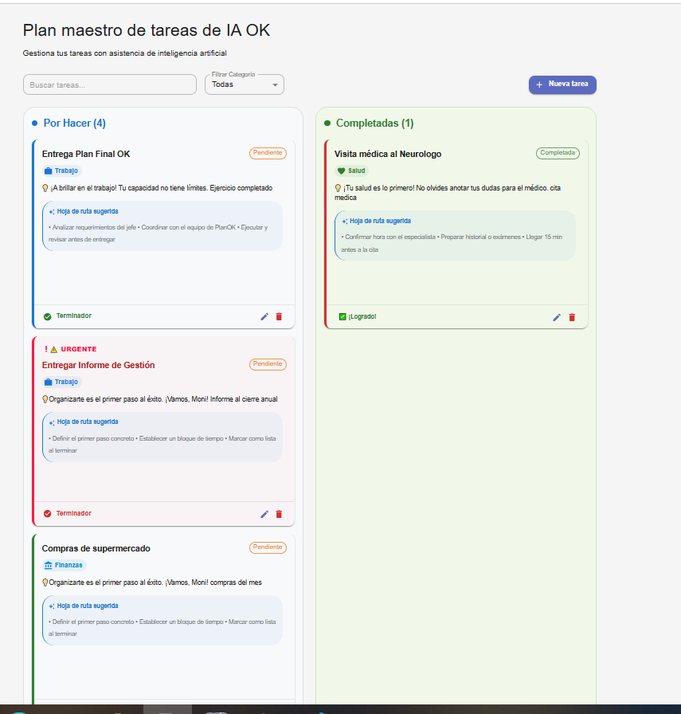
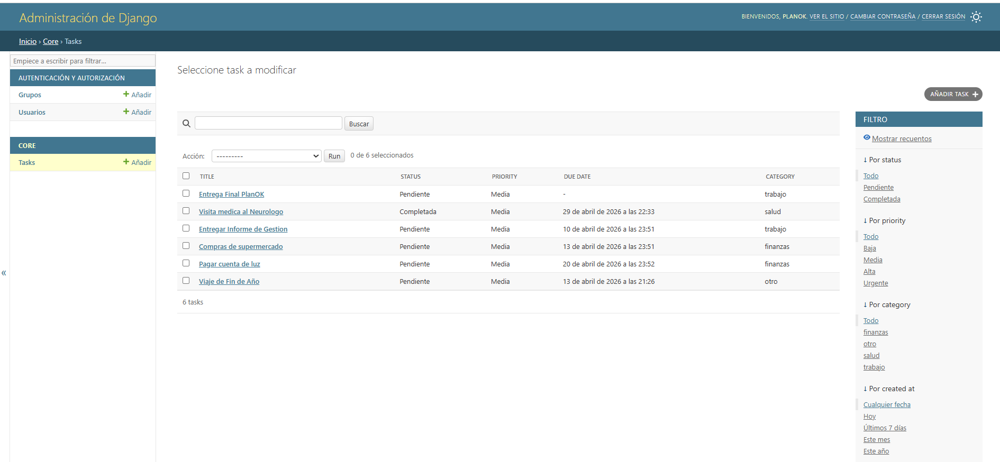
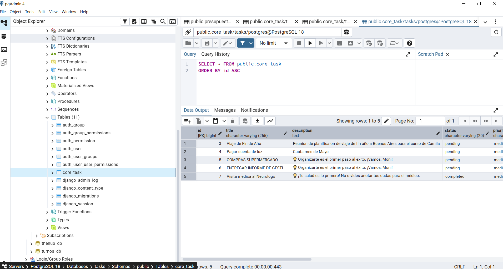
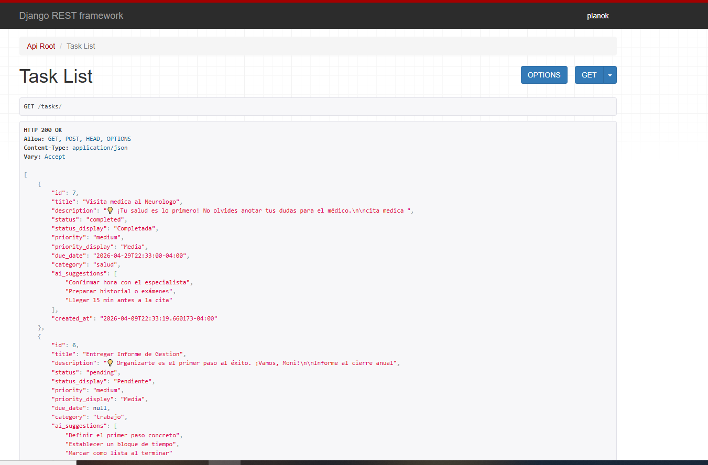

# AI-Task Master PlanOK 🚀

He diseñado este gestor de tareas inteligente para la prueba técnica de **Fullstack Developer IA** en PlanOK. Mi objetivo fue transformar una base técnica con desafíos de integración en un asistente de productividad real, donde la IA analiza la carga de trabajo y el sistema responde proactivamente a las necesidades del usuario.

## 🧠 Funcionalidades de IA Implementadas
* **Clasificación Automática:** Análisis de contenido para asignar categorías (Salud, Trabajo, Finanzas, Estudio) de forma autónoma.
* **Sugerencia de Subtareas (Hoja de Ruta):** Generación de pasos concretos basados en la descripción de la tarea para facilitar el inicio de la ejecución.
* **Coach de Productividad:** Integré mensajes motivacionales y consejos personalizados dinámicos.
* **Gestión Dinámica de Urgencia (Alerta IA):** Implementé un motor de urgencia en el Backend que monitorea las fechas límite. Si una tarea vence en menos de 24 horas, el sistema escala automáticamente su prioridad a **"⚠️ URGENTE"**, disparando una alerta visual roja en el Frontend.

## 📸 Galería del Proyecto

### Interfaz Principal (Frontend)
Diseño "Corporate Flat" con alta densidad de datos y alertas de urgencia integradas.

### Panel Administrativo (Backend)
Gestión avanzada y auditoría de datos mediante el Admin de Django.

### Persistencia de Datos (PostgreSQL)
Verificación de la estructura de tablas y datos reales mediante pgAdmin 4.

### Estructura de la API (JSON)

---

## 💡 Algunas reflexiones

Como profesional en transición hacia el desarrollo Fullstack, mi proceso de aprendizaje y trabajo tiene un matiz distinto al del programador tradicional. En este proyecto, enfrenté el desafío de colaborar con compañeros que manejan una rapidez y un lenguaje técnico que, en ocasiones, me hicieron sentir fuera de lugar. Sin embargo, creo que mi valor reside en un lugar donde la experiencia es clave: **la capacidad de estructurar soluciones con visión de conjunto.**

* **Traduciendo el caos en lógica:** Aunque reconozco que aún estoy integrando la terminología técnica avanzada a mi vocabulario, mi mente trabaja de forma sistémica. Mi enfoque prioriza entender la **arquitectura del problema** y la estructura de las funciones antes de la ejecución. 
* **Análisis frente a la velocidad:** Al sentirme menos escuchada en la rapidez del debate técnico, opté por observar el "mapa completo". Esto me permitió identificar incoherencias en la lógica que se estaba planteando y asegurar que el flujo de datos entre el Backend y el Frontend fuera coherente y funcional.
* **Sabiduría estratégica:** Entiendo que la programación es un lenguaje que sigo perfeccionando, pero la ingeniería y la resolución de problemas son habilidades que ya forman parte de mi ADN profesional. Mi aporte no es la velocidad de codificación, sino la **estabilidad y la visión estratégica**.

## 🔍 Resolución de Problemas y Adaptación Técnica
Durante el desarrollo, identifiqué y resolví los siguientes puntos críticos para asegurar la entrega:

### 1. Adaptación del Frontend y Visibilidad del Dato
Detecté que el Frontend original no comunicaba la inteligencia del Backend. Modifiqué los componentes de React para que pudieran interpretar y mostrar la **Prioridad Dinámica**, logrando que la "magia" de la IA fuera útil para el usuario final.

### 2. Sincronización del Trabajo en Equipo (Backend)
Tomé el control de la integración del Backend, configuré manualmente el entorno de PostgreSQL, sincronicé las credenciales y ejecuté las migraciones necesarias para que la API finalmente pudiera persistir datos.

### 3. Decisión Ejecutiva: Infraestructura
Ante conflictos de compatibilidad de Docker en mi equipo local, tomé la decisión de levantar el entorno de forma nativa. Esto garantizó que el 100% de mi tiempo se invirtiera en la lógica de negocio y en la funcionalidad de la IA para cumplir con el plazo.

---

## 🛠️ Stack Tecnológico Utilizado
* **Backend:** Python + Django REST Framework.
* **Base de Datos:** PostgreSQL (Administrada con pgAdmin 4).
* **Frontend:** React + Material UI.

## 🚀 Instrucciones de Ejecución
1. **Backend:** Entrar a `back-tasks-planok-main`, instalar dependencias con `pip install -r requirements.txt` y ejecutar `python manage.py runserver`.

> **Acceso al Administrador (Django Admin):**
> URL: `http://127.0.0.1:8000/admin/`
> * **Usuario:** `planok`
> * **Clave:** `pk123`

2. **Frontend:** Entrar a `planok-frontend-main`, instalar dependencias con `npm install` y ejecutar `npm run dev`.

---

## 📬 Compromiso con la Mejora Continua y Contacto

Soy plenamente consciente de que este trabajo es una primera aproximación y que puede resultar básico frente a los estándares de una empresa tecnológica de alto nivel. Sin embargo, he realizado este desarrollo con la convicción de **cumplir con la palabra empeñada y no dejar una entrega inconclusa**.

Más allá del resultado del proceso de selección, **valoraría profundamente cualquier retroalimentación** técnica o metodológica sobre este trabajo. Mi objetivo es identificar mis deficiencias actuales para fortalecer mis habilidades en futuras entrevistas y seguir creciendo como desarrolladora.

* **Desarrolladora:** Monica Pradines
* **Correo:** mpradinesa@gmail.com
* **Repositorio:** [https://github.com/Mpradinesa/AI-Task-Master-PlanOK.git](https://github.com/Mpradinesa/AI-Task-Master-PlanOK.git)

